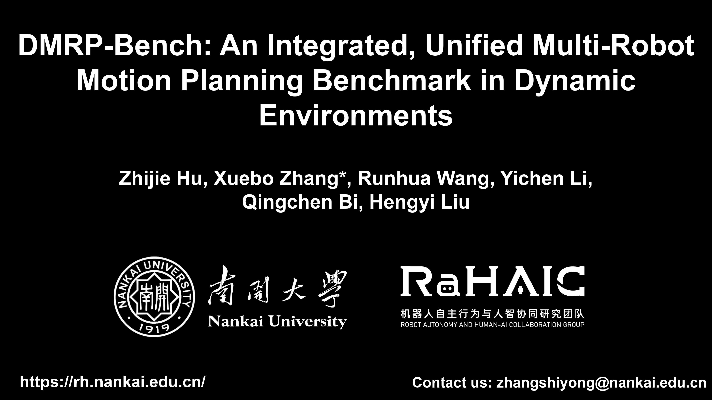

# DMRP-Bench: A Benchmark for Multi-Robot Motion Planning in Dynamic Environments

DMRP-Bench is a unified benchmarking framework for evaluating multi-robot motion planning in high-fidelity dynamic environments, built on NVIDIA Isaac Sim and ROS. It supports various global and local planners, and introduces fine-grained interaction metrics (STO, IBTR, LDF, PFD).

[](https://youtu.be/your-video-link)

## Quick Start

### 1. Prerequisites
- Ubuntu 20.04/22.04
- ROS Noetic ([installation](http://wiki.ros.org/noetic/Installation/Ubuntu))
- NVIDIA Isaac Sim 2022.2.1+ ([download](https://developer.nvidia.com/isaac-sim))
- Python 3.8+, tmux

### 2. Installation

```bash
# Clone the repository
git clone https://github.com/NKU-MobFly-Robotics/DMRP-Bench.git
cd DMRP-Bench

# Install ROS navigation packages
sudo apt install ros-noetic-navigation ros-noetic-teb-local-planner

# Install Python dependencies
pip install -r requirements.txt

# Install system dependencies via rosdep
rosdep install --from-paths src --ignore-src -r -y

# Build the workspace
cd ~/DMRP-Bench
catkin_make -DCMAKE_BUILD_TYPE=Release
source devel/setup.bash
### 3. Run a Benchmark
Step 1: Launch the simulation
Start Isaac Sim:

bash
/path/to/isaac_sim/isaac-sim.sh
In Isaac Sim, open File → Open and select one of the provided scene files in the scenes/ directory, e.g., Library.usd, OpenOffice.usd, or Shopping.usd. 

Step 2: Start the ROS socket server
bash
cd scripts
python3 pose_socket_server.py
Step 3: Send pedestrian poses from Isaac Sim
In Isaac Sim, open Script Editor (Window → Script Editor) and run the script from scripts/isaac_send_pedestrian_poses.py (copy the code from that file).

The system will automatically start planning and recording data. Bag files are saved in the bags/ directory inside the repository.

### 4. Analyze Results
bash
python3 scripts/analyze_multi_robot_bag.py --bag ./bags/your-bag-file.bag
The analysis report will be saved as your-bag-file_analysis.txt.

Configuration
Local planners: To adjust parameters for TEB, DWA, MPC, or Ceres, modify the corresponding YAML files in move_base_benchmark/params/. To switch between different local planners, edit the launch file move_base_benchmark/launch/aa.launch.

Global planners: To change the global planner (CBS, ECBS-8, SIPP, EECBS), modify the launch file mapf_base/launch/mapf_example.launch and specify the desired planner type.

Pedestrian models: The actors in the scene already have collision properties; no extra setup needed.

Citation
If you use this benchmark in your research, please cite:

bibtex
@inproceedings{hu2026dmrp,
  title={DMRP-Bench: An Integrated, Unified Multi-Robot Motion Planning Benchmark in Dynamic Environments},
  author={Hu, Zhijie and Zhang, Xuebo and Wang, Runhua and Li, Yichen and Bi, Qingchen},
  booktitle={2026 IEEE International Conference on Robotics and Automation (ICRA)},
  year={2026}
}
